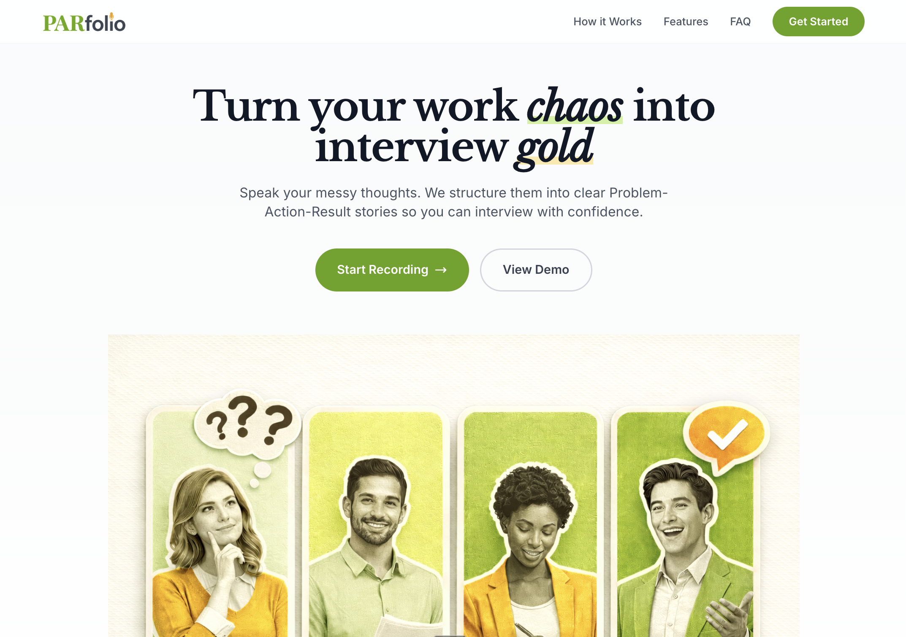
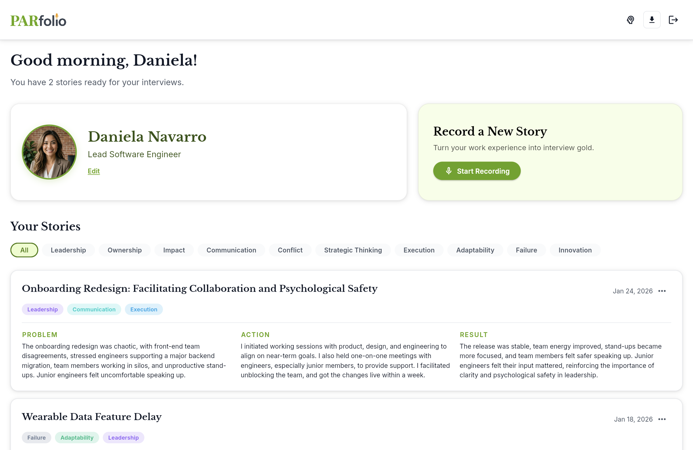

# PARfolio

> **Turn your work experiences into interview-ready stories.**

PARfolio is an AI-powered voice-first app that helps mid-career professionals capture, structure, and organize their work experiences into interview-ready PAR (Problem–Action–Result) narratives.

---

## The Problem

Mid-career professionals have valuable career stories in their heads, but those stories are messy, unstructured, and easy to forget—making interview preparation time-consuming, stressful, and inconsistent.

## The Solution

PARfolio listens to your rambling work stories, automatically structures them into a clear Problem–Action–Result format, categorizes them by behavioral competency, and stores them for easy retrieval.

---

## Key Features

- 🎙️ **Voice-First Recording**: Capture your work stories naturally through speech.
- 🤖 **AI Orchestrator**: Converts rambling speech into structured PAR (Problem-Action-Result) stories.
- 🏷️ **Behavioral Tagging**: Auto-assigns competencies like Leadership, Communication, and Impact.
- ⚡ **All-in-One Pipeline**: Orchestrate the entire flow from raw audio/text to polished PAR story in a single API call.
- 🧠 **Personal Memory**: Upload resumes, LinkedIn data, articles, and transcripts (supports drag and drop on web/desktop) for AI-powered semantic search and personalized coaching.
- 🛠️ **Agentic Coaching**: AI agent autonomously retrieves user context from memory to personalize feedback.
- 📁 **Story Bank**: Manage, filter, and export your polished narratives.

---

## Screenshots

### Landing Page

*The PARfolio landing page showcasing the voice-first approach to capturing work stories.*

### Dashboard

*The main dashboard where users manage their structured PAR stories and behavioral competencies.*

---

## Tech Stack

| Layer | Technology |
|-------|------------|
| **Frontend (App)** | Flutter (Web) |
| **Marketing (Landing)** | HTML, CSS, JS (Balanced/Professional Design) |
| **Backend** | FastAPI (Python) |
| **Database** | Firebase Firestore |
| **Auth** | Firebase Authentication |
| **Storage** | Firebase Storage (GCS) |
| **Speech-to-Text** | Google Cloud Speech-to-Text API |
| **Vector DB** | ChromaDB (Local) |
| **AI/LLM** | Google Gemini 2.0 Flash & Pro (Primary) |

---

## Project Structure

```
parfolio/
├── frontend/                 # Flutter Web App
│   ├── lib/                  # Dart source code
│   └── web/                  # Web entry point
├── backend/                  # FastAPI server
│   ├── main.py               # Entry point
│   ├── memory/               # Personal memory logic (ChromaDB, parsing, chunking)
│   ├── data/                 # Local data storage (ChromaDB persistence)
│   ├── ai/                   # AI processing (LangChain, Google Speech-to-Text, transcription)
│   ├── firebase_config.py    # Firebase initialization
│   ├── firebase_storage.py   # Firebase Storage utilities
│   ├── models/               # Pydantic data models
│   ├── routers/              # API route handlers
│   ├── dependencies/         # Auth & shared dependencies
│   ├── samples/              # Sample dataset (Transcripts, Memory files)
│   ├── tests/                # Verification and unit tests
│   ├── requirements.txt      # Python dependencies
│   └── .env.example          # Environment template
├── marketing/                # Landing Page
│   ├── index.html            # Main entry point
│   ├── style.css             # Vibrant design styles
│   ├── script.js             # Interactions
│   └── assets/               # Images and mockups
├── assets/                   # Brand & visual assets
│   ├── logos/                # Logo system (specs, prompts, files)
│   └── screenshots/          # Application screenshots
├── docs/
│   ├── overview.md           # Product overview & pitch
│   ├── spec_sheet.md         # Technical spec (schema, endpoints)
│   └── design_system.md      # Design system documentation
└── README.md
```

---

## Getting Started

### Backend Setup

1. Navigate to the `backend` directory:
   ```bash
   cd backend
   ```

2. Set up a virtual environment:
   ```bash
   python3 -m venv venv
   source venv/bin/activate
   ```

3. Install dependencies:
   ```bash
   pip install -r requirements.txt
   # Note: Includes ChromaDB for vector storage
   ```

4. Create a `.env` file based on `.env.example`

   **Environment Configuration:** The backend uses environment-aware settings:
   - **Local development** (default): Uses `data/chromadb_local` for vector storage and allows all localhost CORS origins
   - **Production**: Set `ENVIRONMENT=production` in `.env` to use `data/chromadb` and restricted CORS

5. Start the server on **port 8000** (ensure virtual environment is active):
   ```bash
   # If venv is activated (from step 2):
   uvicorn main:app --reload --port 8000

   # Or run directly without activation:
   ./venv/bin/uvicorn main:app --reload --port 8000
   ```

   The backend API will be available at `http://localhost:8000`

   **Note:** CORS is automatically configured to accept requests from any `localhost` port in development mode, allowing Flutter's dynamic port assignment to work seamlessly.

6. **AI Verification**: Run tests against AI and Stories endpoints:
   ```bash
   # Test AI Tagging
   python tests/test_ai_tagging.py

   # Test Stories CRUD (Standard pytest)
   export PYTHONPATH=$PYTHONPATH:.
   pytest tests/test_stories_unit.py
   ```

### App Setup (Flutter)

1. Navigate to the `frontend` directory:
   ```bash
   cd frontend
   ```

2. Install dependencies:
   ```bash
   flutter pub get
   ```

3. Run the app:
   ```bash
   # For Chrome (automatically connects to localhost:8000 in debug mode)
   flutter run -d chrome
   ```

#### Backend URL Configuration

The Flutter app uses **environment-aware** backend URL configuration:

**Default Behavior:**
- **Debug mode** (`flutter run`): Uses `http://localhost:8000`
- **Release mode** (`flutter build`): Uses production Azure URL

**Override with Environment Variable:**
```bash
# Force production URL in debug mode
flutter run --dart-define=BACKEND_URL=https://parfolio-backend.westcentralus.cloudapp.azure.com

# Use custom localhost port
flutter run --dart-define=BACKEND_URL=http://localhost:3000

# For Android emulator with local backend
flutter run --dart-define=BACKEND_URL=http://10.0.2.2:8000
```

**For Local Development:** Ensure your backend server is running on port 8000 before starting the Flutter app.

### Local Development: Running Frontend + Backend Together

For full local development with both frontend and backend:

**Terminal 1 - Start Backend API:**
```bash
cd backend
uvicorn main:app --reload --port 8000
```
Backend runs at: `http://localhost:8000`

**Terminal 2 - Start Flutter App:**
```bash
cd frontend
flutter run -d chrome
```
Frontend runs at: `http://localhost:<dynamic-port>` (e.g., 60153)

The Flutter app will automatically connect to your local backend at `http://localhost:8000` in debug mode. The backend is configured to accept requests from any localhost port (Flutter uses dynamic ports).

### Marketing Site Setup (Landing Page)

Simply open `marketing/index.html` in your browser for a standalone preview.

### Running Landing Page and App Together

To test the full flow where the landing page links directly to the app:

1. **Start the Backend** (in a separate terminal):
   ```bash
   cd backend
   ./venv/bin/uvicorn main:app --reload
   ```

2. **Build the Flutter App**:
   ```bash
   cd frontend
   flutter build web --base-href /app/
   cd ..
   ```

3. **Start the Local Server**:
   ```bash
   python3 local_server.py
   ```

4. **Access the Application**:
   - Open `http://localhost:8080` for the landing page.
   - Click **"Start Recording"** or **"Get Started"** to navigate seamlessly into the app.

---

## Production Deployment

PARfolio is deployed in production with the following architecture:

- **Frontend:** https://parfolio.app (Hostinger static hosting)
- **Backend:** https://parfolio-backend.westcentralus.cloudapp.azure.com (Azure VM with Nginx + Let's Encrypt)
- **Database:** Firebase (Firestore, Auth, Storage)
- **AI Services:** Google Gemini AI, Google Speech-to-Text, Tavily API

### Quick Deployment

**🚀 Automated Scripts (Recommended)**

Deploy backend:
```bash
./scripts/deploy-backend.sh
```

Deploy frontend:
```bash
./scripts/deploy-frontend.sh
# Then upload deploy/ folder to Hostinger
```

See **[Deployment Quick Start Guide](docs/deployment_quick_start.md)** for step-by-step instructions.

### Deployment Guides

- **[Deployment Quick Start](docs/deployment_quick_start.md)** — Simplest way to deploy (use this!)
- **[Azure VM Deployment Guide](docs/azure_deployment.md)** — Full backend deployment on Azure with SSL/TLS
- **[Azure Quick Start](docs/azure_quick_start.md)** — Fast setup for backend deployment
- **[Frontend Deployment Guide](docs/frontend_deployment_guide.md)** — Building and deploying Flutter web to Hostinger

### Key Production Features

- ✅ **HTTPS Everywhere:** Backend secured with Let's Encrypt SSL
- ✅ **Auto-restart:** Systemd service with failure recovery
- ✅ **Long Audio Support:** Handles recordings up to 8 hours via GCS upload
- ✅ **Cost-Optimized:** Runs on 1GB RAM VM (~$10-15/month) using API-based services
- ✅ **Auto-scaling AI:** Google Cloud APIs handle transcription and AI processing

---

## Documentation

- [Product Overview](docs/overview.md) — User persona, problem, solution, and pitch
- [Technical Spec Sheet](docs/spec_sheet.md) — Data schema, API endpoints, and examples
- [Design System](docs/design_system.md) — Visual language, colors, and component specs
- [Backend AI Implementation Guide](docs/backend_ai_implementation_guide.md) — Strategy for building the AI pipeline
- [Frontend AI Implementation Guide](docs/frontend_ai_implementation_guide.md) — Phase-by-phase frontend implementation

---

## License

MIT
