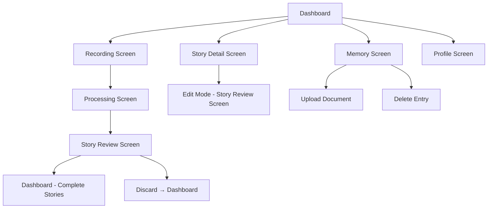

# Frontend AI Implementation Guide

> **Purpose**: Comprehensive guide for implementing the frontend AI-related flows in PARfolio.
>
> **Status**: Phase 1-4 Complete ✅ | Phase 5 Pending

---

## Overview

This guide covers the frontend implementation required to complete the AI-powered story creation flow. The backend AI endpoints are fully implemented (see `backend_ai_implementation_guide.md`). This guide focuses on connecting the Flutter frontend to these endpoints and building the user-facing screens.

### Current State

**Already Implemented:**
- Recording screen with audio capture and playback
- Dashboard with story list and tag filtering
- Story detail screen (view only)
- Profile screen with career details
- Authentication flow
- Stories CRUD Backend (Prerequisite)
- **Phase 1: AI Service Integration** ✅
  - Audio upload to Firebase Storage
  - AI processing integration (`/ai/process`)
  - Story creation from AI-processed data
  - Basic processing loading screen

**To Be Implemented:**
- Enhanced processing loading screen with stages (Phase 2) ✅
- Story review/edit screen (Phase 3)
- Enhanced dashboard with P/A/R preview (Phase 4) ✅
- Memory screen for document uploads (Phase 5)

> [!IMPORTANT]
> **Design System Compliance**: All UI components in this guide must adhere to the [Design System](./design_system.md). Reference it for colors, typography, spacing, shadows, and component patterns to ensure visual consistency.

---

## Implementation Order

### Phase 0: Stories CRUD Backend (Prerequisite) ✅

Before frontend work, the backend needs Stories CRUD endpoints.

> [!IMPORTANT]
> This phase is a **backend prerequisite**. The frontend guide assumes these endpoints exist.

**Endpoints Needed:**

| Method | Endpoint | Description |
|--------|----------|-------------|
| `POST` | `/stories` | Create new story (accepts full story payload) |
| `GET` | `/stories` | List all stories for current user (filter by status) |
| `GET` | `/stories/{story_id}` | Get single story by ID |
| `PUT` | `/stories/{story_id}` | Update story (edit PAR, tags, status) |
| `DELETE` | `/stories/{story_id}` | Delete a story |

**Schema Reference** (from `spec_sheet.md`):
```json
{
  "story_id": "abc123",
  "user_id": "uid_456",
  "title": "Led Cross-Functional Team...",
  "rawTranscriptUrl": "gs://...",
  "audioUrl": "gs://...",
  "problem": "...",
  "action": "...",
  "result": "...",
  "tags": ["Leadership", "Communication"],
  "coaching": { "strength": "...", "gap": "...", "suggestion": "..." },
  "status": "draft" | "complete",
  "createdAt": "...",
  "updatedAt": "..."
}
```

**Tasks:**
- [x] Create `routers/stories_router.py` with CRUD endpoints
- [x] Add Firestore integration for stories collection
- [x] Support `?status=complete` query filter for dashboard
- [x] Update `main.py` to include stories router

---

### Phase 1: AI Service Integration ✅
**Goal**: Connect recording flow to AI processing backend.

**Status**: Complete (January 17, 2026)

**New Files:**
- `lib/services/ai_service.dart` - API client for AI endpoints
- `lib/models/ai_models.dart` - Request/response models for AI processing
- `lib/screens/processing_screen.dart` - Basic loading screen during AI processing

**Modified Files:**
- `lib/screens/recording_screen.dart` - Implement `_saveAndProcessing()`
- `lib/services/story_service.dart` - Add `createStory()` and `updateStory()`
- `pubspec.yaml` - Add `uuid` dependency

#### 1.1 Create AI Service

```dart
// lib/services/ai_service.dart
class AIService {
  /// Uploads audio to Firebase Storage, then calls /ai/process
  Future<ProcessedStoryResponse> processRecording({
    required String userId,
    required String audioFilePath,
  }) async {
    // 1. Generate story ID (UUID)
    // 2. Upload audio to Firebase Storage: {userId}/audio/{storyId}.wav
    // 3. Call POST /ai/process with audio_url
    // 4. Return parsed response
  }
}
```

**API Request Model:**
```dart
class ProcessRequest {
  final String audioUrl;
  final String storyId;
  final String userId;
  final String? rawTranscript; // Optional: skip transcription if provided
}
```

**API Response Model:**
```dart
class ProcessedStoryResponse {
  final String storyId;
  final String title;
  final String? rawTranscriptUrl;
  final String problem;
  final String action;
  final String result;
  final List<String> tags;
  final CoachingInsights? coaching;
  final List<String> warnings; // For partial failures
  final double? confidenceScore;
}
```

#### 1.2 Update Recording Screen

Replace the placeholder `_saveAndProcessing()`:

```dart
void _saveAndProcessing() async {
  if (_recordedFilePath == null) return;
  
  // Navigate to processing screen with file path
  Navigator.pushReplacement(
    context,
    MaterialPageRoute(
      builder: (context) => ProcessingScreen(
        audioFilePath: _recordedFilePath!,
      ),
    ),
  );
}
```

#### 1.3 Update Story Service

Add methods for CRUD operations:

```dart
class StoryService {
  // Existing: getStories(), getStory(), deleteStory()
  
  /// Create a new story (draft status)
  Future<StoryModel> createStory(ProcessedStoryResponse data) async { ... }
  
  /// Update story (e.g., edit PAR, tags, or mark as complete)
  Future<StoryModel> updateStory(String id, Map<String, dynamic> updates) async { ... }
}
```

**Tasks:**
- [x] Create `lib/services/ai_service.dart`
- [x] Add audio upload to Firebase Storage utility
- [x] Implement `/ai/process` API call
- [x] Create request/response models in `lib/models/ai_models.dart`
- [x] Update `story_service.dart` with create/update methods
- [x] Wire up `_saveAndProcessing()` to navigate to `ProcessingScreen`
- [x] Add `uuid` dependency for story ID generation

---

### Phase 2: Processing Loading Screen ✅
**Goal**: Engaging loading experience while AI processes the story.

**Status**: Complete (January 17, 2026)

**New Files:**
- `lib/screens/processing_screen.dart`
- `lib/widgets/processing/stage_progress_indicator.dart`
- `lib/widgets/processing/rotating_message.dart`

#### 2.1 Screen Design

**Layout:**
```
┌─────────────────────────────────┐
│                                 │
│      [Animated Illustration]    │
│                                 │
│   ════════════════════════════  │  ← Stage progress bar
│   ● ─── ● ─── ● ─── ○           │  ← 4 stages indicator
│                                 │
│   "Analyzing your narrative     │  ← Rotating message
│    structure..."                │
│                                 │
│   Usually takes 15-30 seconds   │  ← Time estimate
│                                 │
└─────────────────────────────────┘
```

#### 2.2 Processing Stages & Messages

| Stage | Backend Step | Messages (rotate every 3s) |
|-------|--------------|---------------------------|
| 1 | Transcribing | "Listening to your story...", "Converting speech to text...", "Capturing every detail..." |
| 2 | Structuring | "Analyzing your narrative...", "Identifying the Problem, Action, and Result...", "Crafting your story arc..." |
| 3 | Tagging | "Discovering your superpowers...", "Identifying behavioral competencies...", "Matching your skills..." |
| 4 | Coaching | "Generating personalized insights...", "Preparing coaching feedback...", "Almost there..." |

#### 2.3 Implementation Notes

- Use `AnimationController` for smooth transitions
- Poll or await the single `/ai/process` call (it handles all stages internally)
- Show approximate stage based on elapsed time (since we don't have streaming):
  - 0-8s: Stage 1 (Transcribing)
  - 8-15s: Stage 2 (Structuring)
  - 15-22s: Stage 3 (Tagging)
  - 22s+: Stage 4 (Coaching)
- On success: Navigate to Story Review Screen
- On error: Show error with retry option

#### 2.4 Error Handling

```dart
try {
  final result = await _aiService.processRecording(...);
  
  // Check for partial failures via warnings
  if (result.warnings.isNotEmpty) {
    _showWarningDialog(result.warnings);
  }
  
  // Navigate to review screen
  Navigator.pushReplacement(context, ...);
  
} catch (e) {
  // Show error state with retry button
  setState(() => _error = e.toString());
}
```

**Tasks:**
- [x] Create `lib/screens/processing_screen.dart`
- [x] Create stage progress indicator widget
- [x] Create rotating message widget with smooth transitions
- [x] Implement time-based stage progression
- [x] Add error state with retry functionality
- [x] Add warning dialog for partial failures

---

### Phase 3: Story Review & Edit Screen ✅
**Goal**: Allow users to review AI output, edit PAR/tags, and save or discard.

**Status**: Complete (January 17, 2026)

**New Files:**
- `lib/screens/story_review_screen.dart`
- `lib/widgets/review/editable_par_section.dart`
- `lib/widgets/review/tag_editor.dart`
- `lib/widgets/review/coaching_display.dart`

#### 3.1 Screen Design

**Layout:**
```
┌─────────────────────────────────┐
│ ←  Review Your Story            │  ← AppBar with back (discard)
├─────────────────────────────────┤
│                                 │
│  [Auto-generated Title]     ✏️  │  ← Editable title
│                                 │
│  ┌─────────────────────────┐    │
│  │ PROBLEM              ✏️ │    │  ← Editable section
│  │ [Content...]            │    │
│  └─────────────────────────┘    │
│                                 │
│  ┌─────────────────────────┐    │
│  │ ACTION               ✏️ │    │
│  │ [Content...]            │    │
│  └─────────────────────────┘    │
│                                 │
│  ┌─────────────────────────┐    │
│  │ RESULT               ✏️ │    │
│  │ [Content...]            │    │
│  └─────────────────────────┘    │
│                                 │
│  TAGS                           │
│  [Tag1 ×] [Tag2 ×] [+ Add]     │  ← Editable tags
│                                 │
│  ─────────────────────────────  │
│  COACHING INSIGHTS              │
│  ┌─ Strength ─────────────┐     │
│  │ [Content...]           │     │
│  └────────────────────────┘     │
│  ┌─ Gap ──────────────────┐     │
│  │ [Content...]           │     │
│  └────────────────────────┘     │
│  ┌─ Suggestion ───────────┐     │
│  │ [Content...]           │     │
│  └────────────────────────┘     │
│                                 │
│  (If coaching unavailable:)     │
│  ⚠️ Coaching insights couldn't  │
│     be generated.               │
│                                 │
├─────────────────────────────────┤
│  [Discard]         [Save Story] │  ← Bottom action bar
└─────────────────────────────────┘
```

#### 3.2 Editing Behavior

**PAR Sections:**
- Tap edit icon → expands to `TextFormField`
- Auto-save on blur (update local state)
- Save button commits all changes to Firestore

**Tags:**
- Display predefined tags as chips with ✕ to remove
- "+" button opens modal with all 10 competency tags to select from
- Max 3 tags enforced
- Tags are user-editable, NOT regenerated by AI

**Coaching:**
- Read-only display
- If `coaching == null`: Show warning placeholder
- No regeneration option in this version

#### 3.3 Save Flow

```dart
void _saveStory() async {
  // 1. Create draft story in Firestore (if not already)
  // 2. Update story with edited content
  // 3. Mark status as "complete"
  // 4. Navigate to dashboard (or story detail)
  
  await _storyService.updateStory(storyId, {
    'title': _titleController.text,
    'problem': _problemController.text,
    'action': _actionController.text,
    'result': _resultController.text,
    'tags': _selectedTags,
    'status': 'complete',
  });
  
  Navigator.pushNamedAndRemoveUntil(context, '/home', (route) => false);
}
```

#### 3.4 Discard Flow

```dart
void _discardStory() async {
  final confirm = await showDialog<bool>(...);
  if (confirm == true) {
    // Delete draft story if already created
    if (_storyId != null) {
      await _storyService.deleteStory(_storyId!);
    }
    Navigator.pop(context);
  }
}
```

**Tasks:**
- [x] Create `lib/screens/story_review_screen.dart`
- [x] Create editable PAR section widget with toggle edit mode
- [x] Create tag editor widget with add/remove functionality
- [x] Create coaching display widget with warning state
- [x] Implement save flow (create + update + status change)
- [x] Implement discard flow with confirmation dialog
- [x] Handle back button behavior (prompt discard)

---

### Phase 4: Enhanced Dashboard ✅
**Goal**: Show complete stories with P/A/R preview snippets.

**Status**: Complete (January 17, 2026)

**Modified Files:**
- `lib/services/story_service.dart` - Added status filter parameter
- `lib/widgets/story_card.dart` - Added P/A/R preview with responsive layout
- `lib/widgets/stories_list.dart` - Added onEdit callback
- `lib/screens/home_screen.dart` - Filter by complete status, edit navigation
- `lib/screens/story_detail_screen.dart` - Edit button navigation
- `lib/screens/story_review_screen.dart` - Added isEditMode parameter

**Modified Files:**
- `lib/widgets/story_card.dart` - Add P/A/R preview
- `lib/screens/home_screen.dart` - Filter by status

#### 4.1 Updated Story Card Design

**Desktop/Tablet (Wide):**
```
┌──────────────────────────────────────────────────────────────┐
│ [Story Title]                                    [⋮ Menu]    │
│ [Tag1] [Tag2]                              Jan 17, 2026      │
├──────────────────────────────────────────────────────────────┤
│ PROBLEM          │ ACTION            │ RESULT               │
│ First 2-3 lines  │ First 2-3 lines   │ First 2-3 lines      │
│ of problem...    │ of action...      │ of result...         │
└──────────────────────────────────────────────────────────────┘
```

**Mobile (Narrow):**
```
┌────────────────────────────┐
│ [Story Title]        [⋮]   │
│ [Tag1] [Tag2]              │
├────────────────────────────┤
│ P: First 2-3 lines...      │
│ A: First 2-3 lines...      │
│ R: First 2-3 lines...      │
├────────────────────────────┤
│ Jan 17, 2026               │
└────────────────────────────┘
```

#### 4.2 Responsive Layout

```dart
Widget build(BuildContext context) {
  final isWide = MediaQuery.of(context).size.width > 600;
  
  return Card(
    child: Column(
      children: [
        _buildHeader(), // Title, tags, date, menu
        if (isWide)
          _buildWideParPreview() // 3 columns
        else
          _buildNarrowParPreview(), // Stacked with P:/A:/R: labels
      ],
    ),
  );
}
```

#### 4.3 Text Truncation

```dart
String _truncate(String text, {int maxLines = 2, int maxChars = 100}) {
  if (text.length <= maxChars) return text;
  return '${text.substring(0, maxChars).trim()}...';
}
```

#### 4.4 Dashboard Filtering

Only show stories with `status: "complete"`:

```dart
// In home_screen.dart _loadData()
final stories = await _storyService.getStories(
  tag: _selectedTag,
  status: 'complete', // Add this filter
);
```

**Tasks:**
- [x] Update `StoryCard` widget with P/A/R preview sections
- [x] Implement responsive layout (wide vs. narrow)
- [x] Add text truncation for preview snippets
- [x] Update `StoryService.getStories()` to support status filter
- [x] Update dashboard to only fetch complete stories
- [x] Update `StoryDetailScreen` to allow returning to edit mode

---

### Phase 5: Memory Screen ⬜
**Goal**: Allow users to upload context documents (resume, LinkedIn, etc.) for personalized coaching.

**New Files:**
- `lib/screens/memory_screen.dart`
- `lib/services/memory_service.dart`
- `lib/models/memory_model.dart`
- `lib/widgets/memory/memory_entry_card.dart`
- `lib/widgets/memory/upload_cta.dart`

#### 5.1 Dashboard Entry Point

Add a "Memory Bank" card to the dashboard:

```
┌─────────────────────────────────────────┐
│  🧠 Memory Bank                         │
│                                         │
│  Upload your resume or LinkedIn to      │
│  get personalized coaching insights.    │
│                                         │
│  [View Memory →]                        │
└─────────────────────────────────────────┘
```

#### 5.2 Memory Screen Design

```
┌─────────────────────────────────────────┐
│ ←  Memory Bank                          │
├─────────────────────────────────────────┤
│                                         │
│  Your uploaded context helps our AI     │
│  personalize coaching to your unique    │
│  background and goals.                  │
│                                         │
│  ┌───────────────────────────────────┐  │
│  │  📄 Upload Document               │  │  ← Primary CTA
│  │  PDF, DOCX, TXT, or Markdown      │  │
│  └───────────────────────────────────┘  │
│                                         │
│  YOUR MEMORIES                          │
│  ─────────────────────────────────────  │
│                                         │
│  ┌───────────────────────────────────┐  │
│  │ 📄 resume_2024.pdf         [🗑️]  │  │
│  │ Resume • Uploaded Jan 15, 2026    │  │
│  │                                   │  │
│  │ "Software engineer with 5 years   │  │
│  │ experience in..."                 │  │
│  └───────────────────────────────────┘  │
│                                         │
│  ┌───────────────────────────────────┐  │
│  │ 📄 linkedin_export.pdf    [🗑️]   │  │
│  │ LinkedIn • Uploaded Jan 10, 2026  │  │
│  │                                   │  │
│  │ "Product Manager at Acme Corp..." │  │
│  └───────────────────────────────────┘  │
│                                         │
│  (Empty state if no memories)           │
│  ┌───────────────────────────────────┐  │
│  │ 📭 No memories yet                │  │
│  │ Upload a document to get started  │  │
│  └───────────────────────────────────┘  │
│                                         │
└─────────────────────────────────────────┘
```

#### 5.3 Memory Service

```dart
// lib/services/memory_service.dart
class MemoryService {
  /// Upload a context file for processing
  Future<MemoryUploadResponse> uploadDocument({
    required String userId,
    required File file,
    required String sourceType, // "resume" | "linkedin" | "other"
  }) async {
    // POST /memory/upload (multipart form)
  }
  
  /// List all memory entries for user
  Future<List<MemoryEntry>> getMemories(String userId) async {
    // GET /memory/entries/{user_id}
  }
  
  /// Delete a memory entry
  Future<void> deleteMemory(String userId, String entryId) async {
    // DELETE /memory/entries/{user_id}/{entry_id}
  }
}
```

#### 5.4 Upload Flow

1. User taps "Upload Document"
2. File picker opens (PDF, DOCX, TXT, MD supported)
3. User selects file
4. Upload starts with progress indicator
5. Backend processes and chunks document (async)
6. Show toast: "Document processing started"
7. On next screen load, new entries appear in list

> [!NOTE]
> The backend processes documents asynchronously. The upload returns quickly with `status: "processing"`. Entries appear in the list once processing completes.

#### 5.5 Memory Entry Display

Show metadata from backend response:
- `source_filename` - Display name
- `source_type` - "Resume" | "LinkedIn" | "Other"
- `created_at` - Upload date
- `content` - Preview snippet (first 100 chars)

**Tasks:**
- [ ] Create `lib/services/memory_service.dart`
- [ ] Create `lib/models/memory_model.dart` with `MemoryEntry` class
- [ ] Create `lib/screens/memory_screen.dart`
- [ ] Create upload CTA widget with file picker
- [ ] Create memory entry card widget
- [ ] Create empty state widget
- [ ] Add "Memory Bank" card to dashboard
- [ ] Implement file upload with multipart form
- [ ] Implement delete with confirmation

---

## Navigation Flow Summary



---

## File Structure Summary

```
lib/
├── models/
│   ├── story_model.dart         # Update with ProcessedStoryResponse
│   └── memory_model.dart         # NEW
├── screens/
│   ├── home_screen.dart          # Modify: filter, Memory card
│   ├── recording_screen.dart     # Modify: wire up save flow
│   ├── processing_screen.dart    # NEW
│   ├── story_review_screen.dart  # NEW
│   ├── story_detail_screen.dart  # Modify: edit mode entry
│   └── memory_screen.dart        # NEW
├── services/
│   ├── ai_service.dart           # NEW
│   ├── story_service.dart        # Modify: create, update
│   └── memory_service.dart       # NEW
└── widgets/
    ├── processing/
    │   ├── stage_progress_indicator.dart  # NEW
    │   └── rotating_message.dart          # NEW
    ├── review/
    │   ├── editable_par_section.dart      # NEW
    │   ├── tag_editor.dart                # NEW
    │   └── coaching_display.dart          # NEW
    ├── memory/
    │   ├── memory_entry_card.dart         # NEW
    │   └── upload_cta.dart                # NEW
    ├── story_card.dart            # Modify: P/A/R preview
    └── memory_bank_card.dart      # NEW
```

---

## Testing Strategy

### Phase 1-2 Testing
- [ ] Mock audio file → verify upload to Firebase Storage
- [ ] Mock `/ai/process` response → verify processing screen stages
- [ ] Test error states and retry logic
- [ ] Test partial failure warnings

### Phase 3 Testing
- [ ] Edit PAR fields → verify local state updates
- [ ] Add/remove tags → verify max 3 limit
- [ ] Save → verify Firestore create/update
- [ ] Discard → verify draft deletion
- [ ] Back button → verify discard prompt

### Phase 4 Testing
- [ ] Verify only complete stories show on dashboard
- [ ] Test responsive layout breakpoints
- [ ] Test text truncation for long content
- [ ] Test navigation to detail/edit screens

### Phase 5 Testing
- [ ] Test file picker for supported formats
- [ ] Test upload progress indication
- [ ] Test delete with confirmation
- [ ] Test empty state display

---

## Dependencies to Add

```yaml
# pubspec.yaml additions
dependencies:
  uuid: ^4.5.1         # For generating story IDs (✅ Added in Phase 1)
  file_picker: ^6.0.0  # For memory document upload (Phase 5)
```

---

## Estimated Timeline

| Phase | Description | Estimated Effort | Status |
|-------|-------------|------------------|--------|
| Phase 0 | Stories CRUD Backend | 2-3 hours | ✅ Complete |
| Phase 1 | AI Service Integration | 3-4 hours | ✅ Complete |
| Phase 2 | Processing Loading Screen | 3-4 hours | ✅ Complete |
| Phase 3 | Story Review & Edit | 4-5 hours | ✅ Complete |
| Phase 4 | Enhanced Dashboard | 2-3 hours | ✅ Complete |
| Phase 5 | Memory Screen | 3-4 hours | ⬜ Pending |

**Total**: ~17-23 hours | **Completed**: ~15-19 hours | **Remaining**: ~3-4 hours

---

## Reference

- [Design System](./design_system.md) - **Required**: Colors, typography, spacing, and component patterns
- [Backend AI Implementation Guide](./backend_ai_implementation_guide.md) - Backend AI endpoints
- [Spec Sheet](./spec_sheet.md) - Full API and data schema reference

